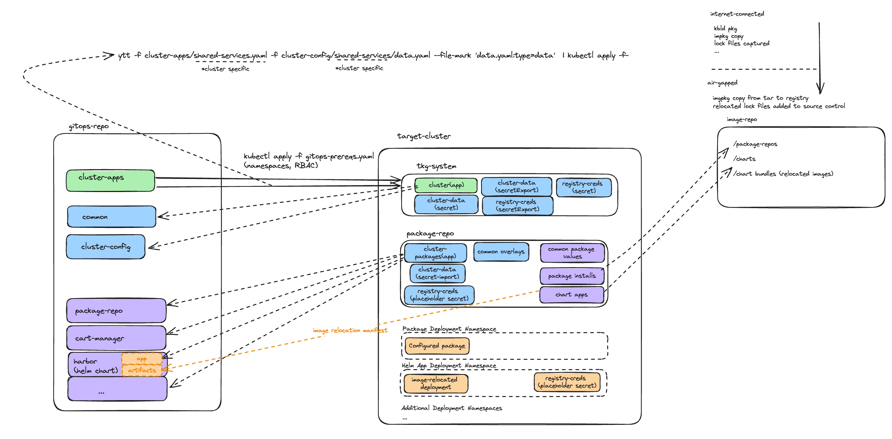

## Apply a cluster profile


Apply prereqs

```bash
kubectl apply -f cluster-apps/gitops-prereqs.yaml
```
Create your encryption key and secret

```bash
age-keygen -o key.txt

kubectl create secret generic enc-key --from-file==key-txt.yaml --dry-run=client -o yaml > enc-key.yaml
```

Take the output of this and create a yaml secret like this (you could use secretgen to duplicate, but should just be these 2 namespaces)

```yaml
---
apiVersion: v1
kind: Secret
metadata:
  name: enc-key
  namespace: tkg-system
stringData:
  key.txt: |
    # created: 2023-11-07T08:28:54-05:00
    # public key: age1k0pw8ujs33xpk0sjuxex64nqhz4c4j5yhus3lka077sv868rv4qq4upsu4
    AGE-SECRET-KEY-1LCH9QTZLSVLUVX8HE07RFPSN8PJF8JGPLJZ3LF6ZSUYLYP64FW6QMM5D0Q
---
apiVersion: v1
kind: Secret
metadata:
  name: enc-key
  namespace: package-repo
stringData:
  key.txt: |
    # created: 2023-11-07T08:28:54-05:00
    # public key: age1k0pw8ujs33xpk0sjuxex64nqhz4c4j5yhus3lka077sv868rv4qq4upsu4
    AGE-SECRET-KEY-1LCH9QTZLSVLUVX8HE07RFPSN8PJF8JGPLJZ3LF6ZSUYLYP64FW6QMM5D0Q
```

Apply the key secrets

```bash
kubectl apply -f enc-key.yaml
```

Create any required cluster specific cluster-config (for example encrypted harbor values)

```bash
#this is an example for a profile with harbor
#there could be any number of cluster specific configurations 
#they don't need to be encrypted if they are not sensative

SOPS_AGE_KEY_FILE=/Users/seufertt/gitops/private/key.txt sops --encrypt --age <pub key>  harbor-values.yaml > harbor-values.sops.yaml

cp harbor-values.sops.yaml cluster-config/<profile name>
```

Create your cluster-app profile

```yaml
---
apiVersion: kappctrl.k14s.io/v1alpha1
kind: App
metadata:
  name: shared-services
  namespace: tkg-system
spec:
  serviceAccountName: kapp-gitops-sa
  fetch:
    - git:
        url: https://github.com/tsfrt/gitops-example
        ref: origin/main
  template:
    - sops:
        age:
          privateKeysSecretRef:
            name: enc-key
    - ytt:
        fileMarks:
        - data.yaml:type=data
        - packages.yaml:type=data
        ignoreUnknownComments: true
        paths:
          - common
          - cluster-config/shared-services 
        valuesFrom:
          - secretRef:
              name: cluster-data
  deploy:
    - kapp: {}

```

Configure your cluster

data.yaml - common values that get used across package installs and for defining resource names

```yaml

---
name: shared-services
harbor_namespace: harbor-test
ingress_domain: ss.h2o-2-18171.h2o.vmware.com
cluster_issuer: cluster_ca
gitops_repo: https://github.com/tsfrt/gitops-example
gitops_ref: origin/main

```

packages.yaml - specify which packages should be deployed to the clusters.  Keep in mind that you will need to populate any common data values in data.yaml or 
drop a cluster specific values file in your cluster config folder.  Any thing with secrets should be encrypted in its own values file. (see harbor example above)

```yaml
packages:
- standard-repo
- cert-manager
- contour
- fluentbit
```

If so, apply the profile

```bash
ytt -f cluster-apps/shared-services.yaml -f cluster-config/shared-services/data.yaml --file-mark 'data.yaml:type=data'  | kubectl apply -f-
```

