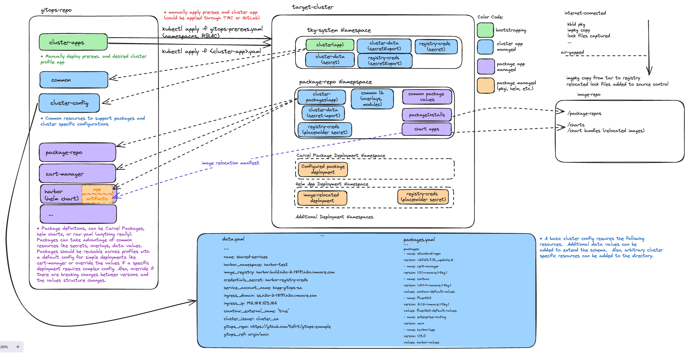

## Apply a cluster app

If you do not already have an encryption key create one as follows.

```bash

age-keygen -o key.txt
```

You will need to generate a git token for your git user with read access to the repository.  Generate the token an be prepared to supply that value later.

If your cluster packages require a values file (harbor, velero, etc) create any required cluster specific values secrets and put them in cluster-config (for example encrypted harbor values)

check out a more detailed process for preparing a helm deployment [Harbor Helm](https://github.com/tsfrt/gitops-example/blob/main/harbor/README.md)

```bash
#this is an example for a profile with harbor
#there could be any number of cluster specific configurations 
#they don't need to be encrypted if they are not sensative

SOPS_AGE_KEY_FILE=/Users/seufertt/gitops/private/key.txt sops --encrypt --age <pub key>  harbor-values.yaml > harbor-values.sops.yaml

cp harbor-values.sops.yaml cluster-config/<cluster app name>
```

Configure your cluster

data.yaml - common values that get used across package installs and for defining resource names

```yaml

---
name: shared-services
harbor_namespace: harbor-test
image_registry: harbor.build.h2o-2-18171.h2o.vmware.com
credentials_secret: harbor-registry-creds
service_account_name: kapp-gitops-sa
ingress_domain: ss.h2o-2-18171.h2o.vmware.com
ingress_ip: 192.168.103.166
countour_external_name: "true"
cluster_issuer: cluster_ca
gitops_repo: https://github.com/tsfrt/gitops-example
gitops_ref: origin/main

```

packages.yaml - specify which packages should be deployed to the clusters.  Keep in mind that you will need to populate any common data values in data.yaml or 
drop a cluster specific values file in your cluster config folder.  Any thing with secrets should be encrypted in its own values file. (see harbor example above)

```yaml
packages:
  - name: standard-repo
    version: v2023.7.13_update.2
  - name: cert-manager
    version: 1.11.1+vmware.1-tkg.1
  - name: contour
    version: 1.24.4+vmware.1-tkg.1
    values: contour-default-values
  - name: fluentbit
    version: 2.1.2+vmware.1-tkg.1
    values: fluentbit-default-values
  - name: enterprise-routing
    version: main
  - name: harbor/app
    version: 1.13.0
    values: harbor-values
```

Some things to know before applying the cluster app

- There must be a cluster config directory that matches your app name
- You must have a key file and the common/registry-creds.sops.yaml must be in encrypted with it

apply your cluster app (make sure you are pointed at the right cluster)

```bash

./setup-cluster.sh \
-a shared-servicesx \
-k "$PWD/../private/key.txt" \
-u tsfrt \
-t xyz \
-b origin/main \
-r https://github.com/tsfrt/gitops-example

```



